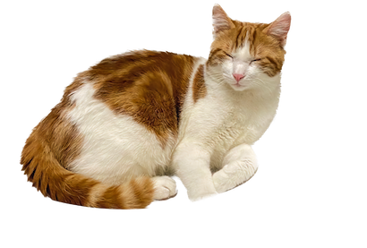

# Who am i ?
I'm Aless, a nerd living & studying in Switzerland.
I speak French and English and my pronouns are he/him.
I believe in an inclusive and eco-friendly tech world.

## What am i doing ?
I got my degree as a software developper in 2023 and I'm currently studying for a diploma of professional maturity in arts.

## What are my hobbies ?
Since I'm a nerd, I of course love 🎮 video games. I mostly play solo games such as RPGs and other genres but maybe I'll elaborate more on that on this blog. I like riding on a 🛹 skateboard sometimes, but I don't like doing tricks. I like to 📖 read when I feel like it and I have a 🐈 cat named Tako which I dearly love.

## What's the setup ?
This part will please the nerds as it's where I list what I use, from software to hardware. 🤓

### hardware
- 💻 laptop : MacBook Air M1 2020 (base model; 8gb ram, 256gb ssd. will upgrade when I have the money)
-  📱 phone : Samsung Galaxy S20 FE 5G
- 🖱️ mouse : Logitech MX Master 3 (great mouse)
- ⌨️ keyboard : Logitech G915 TKL (too pricy for what is is imo, but it's a good keyboard nevertheless)
- 🎧 headphones : Sony WH-1000XM4 (best headphones; noise cancelling is good and it has a really great sound) 

### software
- ⚙️ os : macOS
- 🌍 browser : Arc by The Internet Company of New York ❤️
- 📝 notes : Obsidian (fell into the Obsidian rabbit hole)
- 🎨 theme : catppuccin (same as this website!)